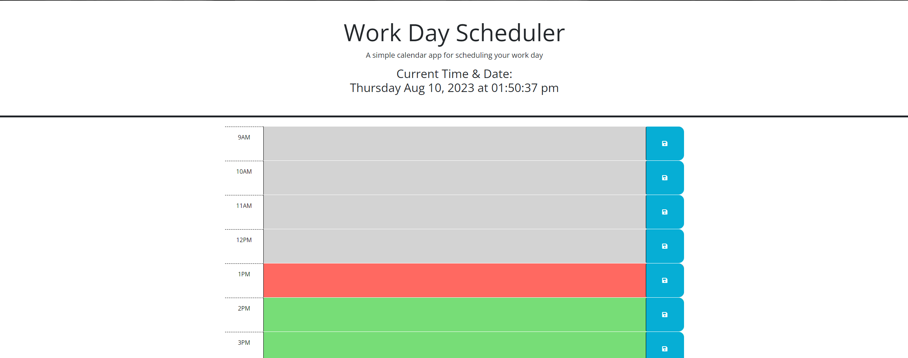

# <Event planner>

## Description

Here is a planner that can be used to plan out an individual's 9am-5pm schedule. Each hour will be color coded to display past, present, and future times according to the background color. Please use the website for your own personal planning. 

## Installation

No installation required to use the website.

## Usage
Github Repository: https://github.com/Richard-Au1/Event-planner

Aplication Website: https://richard-au1.github.io/Event-planner/

Here is a event planner to help with planning out an individual's day.

 It displays the current time and allows the user too know what time it is based off of the color coded hours. grey means the hour has passed for the day, red is the current hour, and green is future hours.

The text boxes can have information inputted into the program that will be saved even if the webpage is refreshed. It is saved after the information is inputted into the text area, then the user presses on the save button on the right hand side. 

## Credits

The mentors I have had along the way.

## License

MIT License

Copyright (c) [2023] [Richard Au]

Permission is hereby granted, free of charge, to any person obtaining a copy
of this software and associated documentation files (the "Software"), to deal
in the Software without restriction, including without limitation the rights
to use, copy, modify, merge, publish, distribute, sublicense, and/or sell
copies of the Software, and to permit persons to whom the Software is
furnished to do so, subject to the following conditions:

The above copyright notice and this permission notice shall be included in all
copies or substantial portions of the Software.

THE SOFTWARE IS PROVIDED "AS IS", WITHOUT WARRANTY OF ANY KIND, EXPRESS OR
IMPLIED, INCLUDING BUT NOT LIMITED TO THE WARRANTIES OF MERCHANTABILITY,
FITNESS FOR A PARTICULAR PURPOSE AND NONINFRINGEMENT. IN NO EVENT SHALL THE
AUTHORS OR COPYRIGHT HOLDERS BE LIABLE FOR ANY CLAIM, DAMAGES OR OTHER
LIABILITY, WHETHER IN AN ACTION OF CONTRACT, TORT OR OTHERWISE, ARISING FROM,
OUT OF OR IN CONNECTION WITH THE SOFTWARE OR THE USE OR OTHER DEALINGS IN THE
SOFTWARE.

